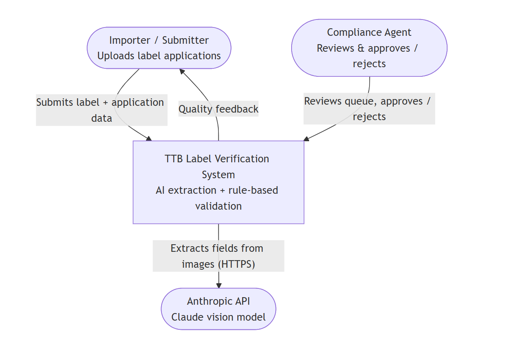
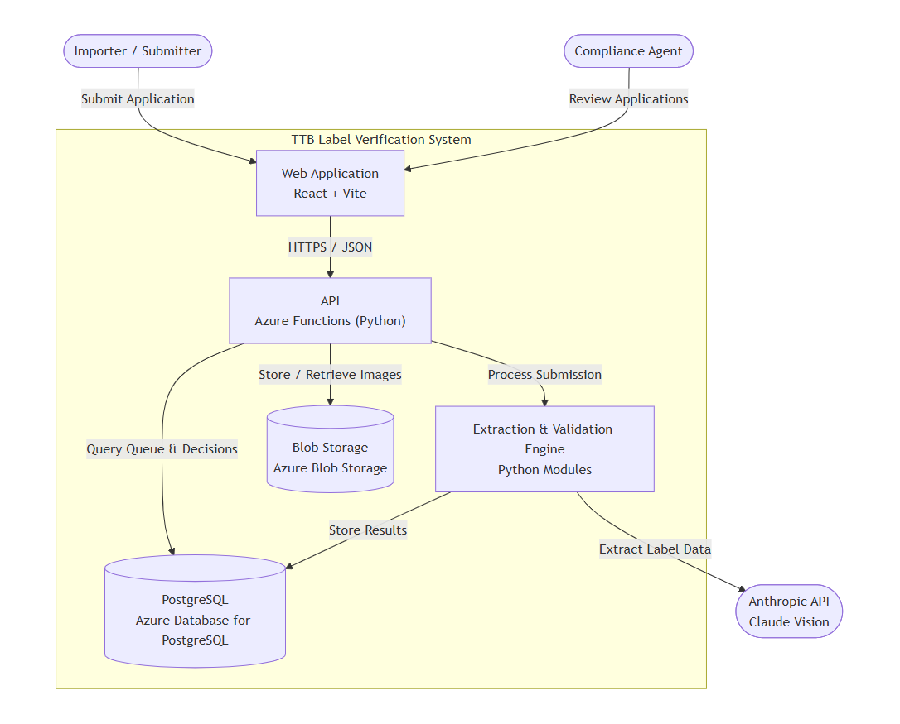

# TTB Label Verification

**Live site:** https://elijahwf.com/ttb

**I thought the best way to share the design was a short video demo and walkthrough**: _[link]_.
This README covers the same ground: approach, tools, and assumptions if you'd rather read.

To show it works end to end I built 20 test applications and generated front-and-back labels for each, 40 images in all, every one with a specific deviation baked in to drive a different branch of the decision logic. 

## The core idea

I split the application process into two workflows so a reviewer never has to sit and wait on an AI model. That's what keeps the reviewer's screen under the 5-second response the spec asked for.

A submitter uploads the front and back of a label plus the data they're declaring. The system reads the label images, compares every declared field against what's actually printed, and decides on the spot: a clean match is approved automatically, an obvious mismatch is rejected automatically, and anything in between is set aside for a human, with direction as to what needs attention. If a submitter disagrees with an auto-rejection they can override it in one click, which sends the application to a reviewer instead. Either way they get an answer immediately.



The split works because the two sides have different tolerances and objectives. I've assumed the submitter can wait: at submission time the API normalizes the images, makes a single Claude call to read the image, runs validation, and writes the verdict to the database, which takes roughly 10 to 20 seconds. The specs identified that reviewers need to have about a 5 second wait time, so when they open the queue much of the heavy lifting is already done. Their expertise goes where it matters: the ambiguous middle and the entries submitters chose to override that require the expertise agents have.

See [docs/architecture.md](docs/architecture.md) for more.

## How a submission flows

```
Submitter ──► SAS upload to quarantine ──► /api/submit
                                            │  Pillow normalize → ONE Claude call
                                            │  (quality check + field extraction)
                unusable image ◄── 400 ─────┤
                                            ▼
                                   validation engine (deterministic)
                                            │  PASS → approve
                                            │  FAIL → auto-reject (override → WARN)
                                            ▼  WARN → agent queue
Agent ──► /review queue ──► field-by-field table + label images ──► Approve / Reject
```



## Decision Engine

The design of the validation engine is a major part of this system. I chose to let AI only do read text off the image. The approve/reject logic is plain Python and is deterministic. I deliberately kept an LLM out of the decision path, because the point of the system is that every verdict is auditable and reproducible. Furthermore, it allows for a tighter grasp on how things are evaluated if guidance changes

The real work is deciding how strict to be, and two things are kept apart:

1. Extraction confidence: is the model sure it read the label correctly? If not within a threshhold, the field goes to WARN so a human looks at the photo and can decide.
2. Match quality: does the printed text mean the same thing as what was declared? This is strict on spelling and content but forgiving on style, so "STONE'S THROW" vs "Stone's Throw" and "LLC" vs "L.L.C." both pass. There are lots of other intricacies here that make the engine really good, but I'll leave that for a deep dive

The rule of thumb is that WARN is reserved for differences agent expertise is needed, like an abbreviation, an acronym, or an extra word. Kicking a submission back to the submitter automatically is a small ask and puts the more of the burden on the submitter instead of the agents. The full PASS/WARN/FAIL ladder and thresholds are in [docs/validation.md](docs/validation.md).

## Tools and infrastructure

| Layer | Choice | Why |
|---|---|---|
| Frontend | React 18 + Vite + Tailwind (SPA, base path `/ttb/`) | Fast build, two routes (`/submit`, `/review`) |
| API | Azure Functions, Python 3.10 | Managed functions come bundled with Static Web Apps, no separate compute bill |
| AI | Claude (`claude-sonnet-4-6`), one image-pair call per submission | OCR-shaped work; latency and cost fit the per-submission budget |
| Hosting | Azure Static Web App (Standard) | Fits cleanly in the environment specs mentioned |
| Database | PostgreSQL Flexible Server (Burstable B1ms) | Structured data, tightens AI writes |
| Storage | Azure Blob (private containers, SAS) | Standard for image storage |
| Public URL | `elijahwf.com/ttb` via a Vercel rewrite | Leverage preexisting personal website to forward to azure and provide URL |

[docs/tradeoffs.md](docs/tradeoffs.md) contains more information on tradeoffs and choices, and the deploy runbook is in [docs/deployment.md](docs/deployment.md). _although, nothing is required since I already deployed it. There is no local version_

## The test fixtures

The 20 cases live in `test-fixtures/`. Each one is a pair of generated label images plus
the declared JSON, and the deviation between the two is the thing under test. I tried to get a large diversity of images and hit many edge cases I can think of for instance switching front and back photos, or things typos that are deliberate (vinyards instead of vineyards). In total there are  6 PASS, 4 WARN, 9 FAIL, 1 unusable.

[test-fixtures/labels/README.md](test-fixtures/labels/README.md) has the exact image-generator prompt with its deviation baked in. The same 20 rows also exist as `batch-sample.csv` for exercising the batch-upload path. 

## Repo map

| Path | What |
|---|---|
| `frontend/` | React + Vite + Tailwind SPA (routes `/submit`, `/review`) |
| `api/` | Azure Functions (Python): submit pipeline, queue/decision endpoints, retention sweep |
| `api/shared/` | `extraction.py` (Claude), `validation.py` (decision engine), `blob.py`, `db.py`, `prompts.py` |
| `infra/main.bicep` | SWA Standard + PostgreSQL + Blob Storage (one-shot provisioning) |
| `db/schema.sql` | Canonical schema (auto-applied by the API on first connection) |
| `vercel.json` | Deliverable for the personal-site repo: `/ttb` rewrites to the SWA |
| `test-fixtures/` | 20-application suite + image-generation spec |
| `docs/` | Architecture, validation rules, trade-offs, retention, deployment, limitations |

## Documentation index

- [docs/architecture.md](docs/architecture.md) — the two-actor model, request flow, serving topology
- [docs/validation.md](docs/validation.md) — the full PASS/WARN/FAIL rules and thresholds
- [docs/tradeoffs.md](docs/tradeoffs.md) — the non-obvious decisions and why
- [docs/deployment.md](docs/deployment.md) — provisioning and deploy runbook
- [docs/retention.md](docs/retention.md) — image and data retention policy
- [docs/limitations.md](docs/limitations.md) — what this prototype intentionally does not do
- [C4 context diagram](docs/c4-level1-context.mermaid) and [C4 container diagram](docs/c4-level2-containers.mermaid) — source for the images above
